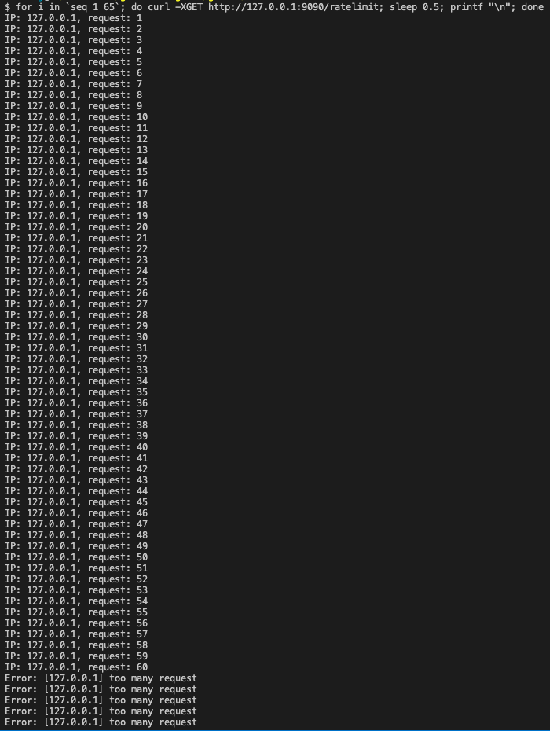

# Rate limit

## How to start

1. 啟動 redis

```
$ cd deployments/
$ docker-compose up -d redis
```

2. 執行 server


回到專案目錄
```
$ make server
```

3. 測試 server

```
curl -XGET http://127.0.0.1:9090/ratelimit
```

## Config rate limit

* 在 configs/app.yml 裡設定 rate limit 參數
  * interval: 允許最大 request 數量的間隔時間，單位: millisecond
  * max_request: 每個時間間隔內允許的最大 request 數量
```
ratelimit:
  interval: 60000 # 單位: millisecond
  max_request: 60
```

## Test Result

