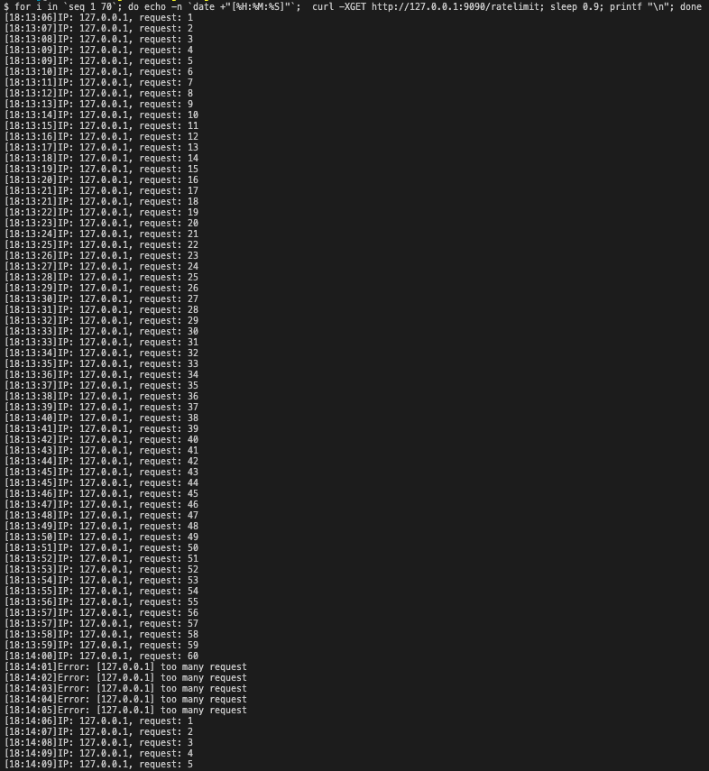

# Rate limit

## How to start

1. 啟動 redis

```
$ cd deployments/
$ docker-compose up -d redis
```

2. 執行 server


回到專案目錄
```
$ make server
```

3. 測試 server

```
curl -XGET http://127.0.0.1:9090/ratelimit
```

## Test Result

